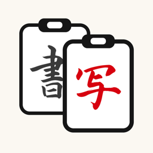
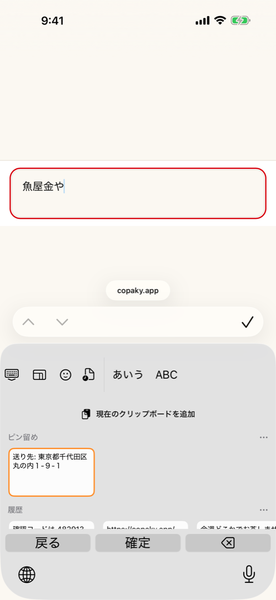
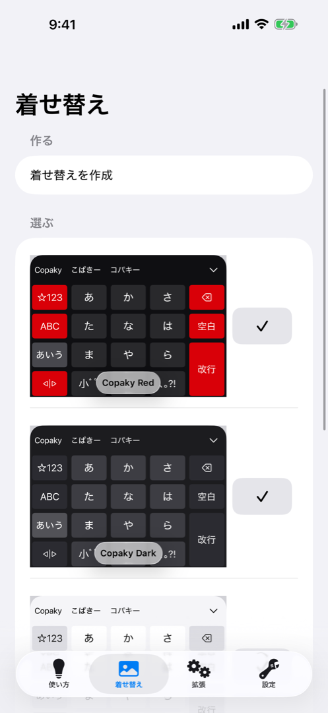

# Copaky（日本語）

*[English](./README.md) · 日本語*

[](./LICENSE)
[](#ビルド)
[](#ビルド)
[-blue.svg)](./CHANGELOG.ja.md)
[](#インストール)
[](./scripts/ci-local.sh)
[](./.github/workflows/codeql.yml)

<br clear="left">

**Copaky** は、iPhone 向けのプライバシー重視の日本語キーボードで、**オフラインのクリップボード管理**機能
を備えています。[azooKey](https://github.com/azooKey/azooKey)（MIT）を基盤とする**独立したプロジェクト**で
あり、azooKey の高品質な日本語変換エンジンを活かしつつ、クリップボード・プライバシー・テレメトリの挙動を
徹底した**オンデバイス／ノーネットワーク**方針で作り直しています。

> [!IMPORTANT]
> **ステータス：プレリリース（v0.1）。** App Store 未公開です。実機での検証は完了し、初回提出に向けて
> 最初の署名付きビルドを TestFlight で内部ドッグフーディング中です。**v0.1 は iPhone 専用**です。
> App Store は一度出荷したデバイスファミリーの削除を認めない（ITMS-90101）ため、iPad 対応は v0.2 に
> 延期しています。

## azooKey をベースに

Copaky は **三輪敬太（ensan）**氏と azooKey コントリビューターの成果の上に成り立っています。キーボードの
大部分 — UI、かな漢字変換、カスタムキー／カスタムタブ — は azooKey 由来です。Copaky は独自のアイデンティティ
を持つ独立したプロジェクトであり、上流の成果に感謝し、しっかりとクレジットを記したうえで公開しています。
ぜひ上流プロジェクトを応援・参照してください：

- azooKey — https://github.com/azooKey/azooKey
- 変換エンジン AzooKeyKanaKanjiConverter — https://github.com/azooKey/AzooKeyKanaKanjiConverter
- macOS 版 azooKey-Desktop — https://github.com/azooKey/azooKey-Desktop

Copaky は変換エンジンの**フォーク** — https://github.com/pettipol/AzooKeyKanaKanjiConverter
（MIT。`AzooKeyCore/Package.swift` でリビジョン固定）— に対してビルドしています。フォークでの追加は
キーボード言語としてのイタリア語（`it_IT`）のみで、それ以外はすべて上流 azooKey の成果です。

完全な帰属表示とサードパーティライセンスは [CREDITS.ja.md](./CREDITS.ja.md) を参照してください。

## スクリーンショット

| オフラインのクリップボード履歴 | 同梱テーマ |
|---|---|
|  |  |

## 機能

- **日本語 IME** — azooKey の変換エンジン（ライブ変換、カスタムキー／カスタムタブ）。
- **オフラインのクリップボード管理** — プライバシーに準拠した、**ユーザー操作起点**のクリップボード履歴。
  ペーストボードが変化した *こと* だけを検知し（メタデータのみ。標準の取り込み操作では「○○からペースト」
  バナーは出ません）、明示的なユーザー操作があったときにのみ値を読み取り・保存します。パスワード／セキュア
  入力欄は決して取得しません。
- **ラテン文字タブ — 英語とイタリア語** — 日本語と並ぶ QWERTY レイアウトは1つです。イタリア語の予測変換は、
  端末のシステム言語がイタリア語であれば初回起動時から自動的にオンになります。それ以外の言語では従来どおり
  設定「イタリア語を使う」でのオプトイン（既定オフ）で、ユーザー自身が明示的に選んだ値は常に自動判定より
  優先されます。オンにすると言語キーが ja → en → it と巡回し、予測はイタリア語辞書から行われます。長押しで
  西欧のアクセント記号を入力できます（è é ê ë · ù ú û ü · ì í î ï · ò ó ô ö õ · à á â ä ã · ñ · ç）。
- **数字ヒント（任意）** — QWERTY 最上段の各キーに数字を小さく表示し、長押しで入力できます（**既定はオフ**）。
- **日本語・英語・イタリア語のインターフェース** — キーボード自身の機能ラベル（改行・空白・次候補・タブの
  「戻る」）も UI 言語に追従し、常に日本語という状態ではなくなりました。未対応の言語は英語にフォールバック
  します。
- **同梱テーマ3種** — Copaky Light／Dark／Red（azooKey のテーマエディタはそのまま利用できます）。
- **完全オフライン（v0.1）** — キーボード拡張も companion アプリも、**一切**ネットワーク通信を行いません。
  カスタードはローカルファイルからのみ読み込み（リモートダウンロードなし）、リモート辞書の取得もありません。
  クリップボード履歴は App Group コンテナ内に保存されます。テレメトリはありません。

## azooKey からの変更点

- プライバシー優先のクリップボード再設計（DETECT／CAPTURE の分離、セキュア入力欄ガード、項目サイズ上限、
  7 日で自動削除）。
- **完全オフライン化**：アプリ全体 — キーボード *および* companion — のネットワークコードを（スタブ化では
  なく）**削除**しました（GitHub の hotfix 辞書取得、リモートのカスタードのダウンロード・共有）。
- テレメトリ／「貢献」レポート機能を**削除**（データ収集なし）。
- azooKey → Copaky へのリブランド（bundle id、App Group、URL スキーム、表示名、UI テキスト）。ただし
  **azooKey のクレジットはすべて保持**しています。
- **Zenzai（ニューラル変換）は v2 に延期** — **v0.1 には含まれません**。v0.1 は azooKey のクラシックな
  （非ニューラル）かな漢字変換を使用します。`zenz` GGUF モデル（CC-BY-SA-4.0）は**バンドルしていない**ため、
  v0.1 の拡張は軽量で、App Store のバイナリに share-alike の重みを含みません。

## 対応言語

| | 入力（キーボード） | インターフェース（アプリ＋キーボードUI） |
|---|---|---|
| 日本語 | フル対応 — azooKey の変換エンジン | 文字列カタログの原語 |
| 英語 | フル対応 — QWERTY、システムのスペルチェック補完 | フル翻訳 |
| イタリア語 | 同梱辞書によるラテン文字タブの予測変換＋長押しアクセント。端末のシステム言語がイタリア語のときのみ既定オン、それ以外はオプトイン | フル翻訳 |

## プライバシー

入力したものもコピーしたものも、端末の外には一切出ません。キーボード拡張も companion アプリも
**ネットワーク通信を一切行わず**、クリップボード履歴も端末外やアカウントに送られることはありません。

## インストール

Copaky は**プレリリース**段階で、App Store にはまだ公開していません。現在は初回提出に向けた
ドッグフーディングとして、少人数の内部 TestFlight グループにのみ配布しており、公開ベータの
参加リンクはまだありません。提出・承認が完了すれば、他の App Store アプリと同様にインストール
できるようになります。その時点でこのセクションにリンクを追記します。

## アーキテクチャ概要

- **`MainApp`** — companion の iOS アプリ本体：オンボーディング、設定、テーマエディタ、カスタード
  インポート、サードパーティのライセンス全文を表示する Acknowledgements 画面。
- **`Keyboard`** — キーボード拡張ターゲット：実際にユーザーが入力する `UIInputViewController`。
  Apple のフルアクセス／ネットワークサンドボックスの規則が直接かかる唯一の面であり、構造的に
  オフラインを保っています（ローカル CI ゲートの `scripts/audit_network_calls.py` で検証）。
- **`AzooKeyCore`** — 両ターゲットが共有するローカルの Swift パッケージ：キーボードビュー、設定
  キー、クリップボード履歴マネージャ、ローカライズカタログ。クリップボード、イタリア語切り替え、
  数字ヒント、ローカライズされたキーラベルなど、Copaky 独自のコードの大部分はここにあります。
- かな漢字変換エンジンはこのリポジトリの**外部依存**です：azooKey の変換エンジンの
  [固定フォーク](https://github.com/pettipol/AzooKeyKanaKanjiConverter) を
  `AzooKeyCore/Package.swift` 経由で取り込んでいます。
- **App Group** コンテナ — `MainApp` と `Keyboard` が共有する唯一の端末内ストレージ（設定・
  クリップボード履歴）。中身がネットワークを越えることはありません。

## ビルド

最新の **Xcode** と（無料の）Apple Developer アカウントが必要です。本プロジェクトは git submodule を使用します。

```sh
git clone --recursive https://github.com/pettipol/copaky.git
cd copaky
open azooKey.xcodeproj      # その後 "MainApp" スキームをビルド＆実行
```

（Xcode プロジェクトのファイル名は上流のまま `azooKey.xcodeproj` です。）

コマンドライン（iOS シミュレータ）：

```sh
xcodebuild build -project azooKey.xcodeproj -scheme MainApp \
  -destination 'platform=iOS Simulator,name=iPhone 17' \
  CODE_SIGNING_ALLOWED=NO CODE_SIGNING_REQUIRED=NO
```

## ローカルファースト CI

これは iOS／UIKit アプリ（無料の Linux ランナーではビルド不可）であり、ホスト型の **macOS** CI は 10 倍で
課金されます。単独メンテナと高性能 Mac という条件では、ゲートは**ローカル**に置きます：

- [`scripts/ci-local.sh`](./scripts/ci-local.sh) — ビルド＋全テストスイートをミラーします（*ここで green
  なら CI も green*）。`--fast` はビルド＋クリップボードテストのみを実行します。
- pre-push フック：`git config core.hooksPath .githooks`（push 前に fast ゲートを実行。`git push
  --no-verify` で回避可能）。
- GitHub Actions のワークフロー（[CodeQL](./.github/workflows/codeql.yml) を含む）は残していますが、
  Actions の分数を消費しないよう **`workflow_dispatch`**（手動）に設定しています — リリース前にメンテナが
  Actions タブから手動実行します。[CONTRIBUTING.ja.md](./CONTRIBUTING.ja.md) を参照してください。

## コントリビューション・セキュリティ・行動規範

- [CONTRIBUTING.ja.md](./CONTRIBUTING.ja.md) — 開発環境構築、ローカル CI ゲート、UI テスト、規約。
- [SECURITY.md](./SECURITY.md) — 脆弱性の非公開報告の方法と、破っていただきたい5つの性質（通信なし、
  クリップボードの読み取りはユーザー起点のみ、セキュア入力欄の除外、端末内のみの保存、フルアクセスは任意）。
- [CODE_OF_CONDUCT.md](./CODE_OF_CONDUCT.md) — 誠実であること。批判するのはコードであって人ではない。

## ロードマップ

[copaky.app/roadmap](https://copaky.app/roadmap) で管理しています。主な項目：iPad 対応（v0.2）、
Zenzai ニューラル変換（v2）。ロードマップの項目は常に「予定」として記載し、「実装済み」とは書きません。

## クレジット

Copaky は **MIT ライセンス**で公開しています — [LICENSE](./LICENSE) を参照してください。azooKey
（MIT, © 三輪敬太／ensan）に加え、変換エンジンを通じてキーボードにリンクされている
[swift-tokenizers](https://github.com/ensan-hcl/swift-tokenizers) や
[Jinja](https://github.com/johnmai-dev/Jinja) を含むその他のサードパーティコンポーネントを含みます。
詳細な一覧は [CREDITS.ja.md](./CREDITS.ja.md) を参照してください。
