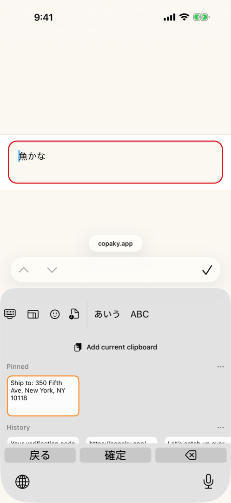
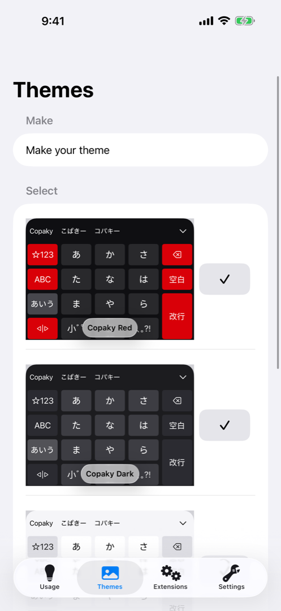

# Copaky

*English · [日本語](./README.ja.md)*

[](./LICENSE)
[](#build)
[](#build)
[-blue.svg)](./CHANGELOG.md)
[](#installation)
[](./scripts/ci-local.sh)
[](./.github/workflows/codeql.yml)

<br clear="left">

**Copaky** is a privacy-focused Japanese keyboard for iPhone, with an **offline clipboard manager**.
It is an **independent project** built on — and crediting — [azooKey](https://github.com/azooKey/azooKey)
(MIT): it keeps azooKey's high-quality Japanese conversion engine while reworking the clipboard, privacy,
and telemetry behaviour around a strict **on-device, no-network** model.

> [!IMPORTANT]
> **Status: pre-release (v0.1).** Not on the App Store yet. Real-device validation is done and the
> first signed build is on TestFlight for internal dogfooding, ahead of the first submission.
> **v0.1 ships for iPhone only**: iPad is deferred to v0.2, because the App Store does not allow
> dropping a device family once it has been shipped (ITMS-90101).

## Based on azooKey

Copaky is built on the work of **Keita Miwa (ensan)** and the azooKey contributors. Most of the keyboard —
the UI, the kana-kanji conversion, the custom keys/tabs — comes from azooKey. Copaky is an independent
project with its own identity, released with gratitude and full credit to the upstream work. Please support
and refer to the upstream project:

- azooKey — https://github.com/azooKey/azooKey
- Conversion engine, AzooKeyKanaKanjiConverter — https://github.com/azooKey/AzooKeyKanaKanjiConverter
- macOS version, azooKey-Desktop — https://github.com/azooKey/azooKey-Desktop

Copaky builds against a **fork** of the conversion engine —
https://github.com/pettipol/AzooKeyKanaKanjiConverter (MIT, pinned by revision in
`AzooKeyCore/Package.swift`) — which adds Italian (`it_IT`) as a keyboard language. Everything else in
the engine is upstream azooKey's work.

See [CREDITS.md](./CREDITS.md) for the full attribution and third-party licenses.

## Screenshots

| Offline clipboard history | Bundled themes |
|---|---|
|  |  |

## Features

- **Japanese IME** — azooKey's conversion engine (live conversion, custom keys / custom tabs).
- **Offline clipboard manager** — a privacy-compliant, **user-initiated** clipboard history. It detects
  *that* the pasteboard changed (metadata only — no "pasted from…" banner on the default capture path) and
  reads/stores the value only on an explicit user action. Password / secure fields are never captured.
- **Latin tab — English and Italian** — one QWERTY layout alongside Japanese. Italian predictions turn on
  automatically the first time the app runs on a phone whose system language is Italian; anywhere else it
  stays an opt-in ("Use Italian" in Settings, off by default; an explicit choice always wins over the
  automatic default). When it is on, the language key cycles ja → en → it and predictions come from an
  Italian dictionary. Long-press gives Western-European accents (è é ê ë · ù ú û ü · ì í î ï · ò ó ô ö õ ·
  à á â ä ã · ñ · ç).
- **Optional number hints** — the QWERTY top row can show each digit above its letter and type it on a
  long press (**off by default**).
- **Interface in Japanese, English and Italian** — including the keyboard's own functional key labels
  (enter, space, next candidate, tab "back"), which follow the interface language instead of always being
  Japanese. Any other system language falls back to English.
- **Three bundled themes** — Copaky Light / Dark / Red, on top of azooKey's theme editor.
- **Offline-true (v0.1)** — **neither** the keyboard extension **nor** the companion app makes any network
  calls. Custards are imported from local files only (no remote download), and there is no remote dictionary
  fetch. Clipboard history lives in the App Group container. No telemetry.

## What Copaky changes vs. azooKey

- Privacy-first clipboard redesign (DETECT / CAPTURE split, secure-field guard, item-size cap, 7-day prune).
- **Offline-true**: all network code is **removed** across the app — keyboard *and* companion (GitHub
  hotfix-dictionary fetch, remote custard download, remote custard sharing) — not merely stubbed.
- Telemetry / "contribution" reporting is **removed** (no data collection).
- Rebrand azooKey → Copaky (bundle id, App Group, URL scheme, display name, UI text) **while keeping all
  azooKey credits**.
- **Zenzai (neural conversion) is deferred to v2** — it is **not part of v0.1**. v0.1 uses azooKey's classic
  (non-neural) kana-kanji conversion. The `zenz` GGUF model (CC-BY-SA-4.0) is **not bundled**, so the v0.1
  extension stays light and ships no share-alike weights in the App Store binary.

## Languages

| | Keyboard input | Interface (app + keyboard UI) |
|---|---|---|
| Japanese | Full — azooKey's conversion engine | Source language of the string catalog |
| English | Full — QWERTY, system spell-checker completions | Full translation |
| Italian | Latin-tab predictions from a bundled dictionary + accented long-press; on by default only when the phone's system language is Italian, opt-in elsewhere | Full translation |

## Privacy

Nothing you type or copy ever leaves the device: the keyboard extension and the companion app make
**zero network calls**, and clipboard history never travels off-device or to any account.

## Installation

Copaky is **pre-release** and not yet on the App Store. Right now it ships to a small internal
TestFlight group for dogfooding ahead of the first public submission — there is no public beta
sign-up link yet. Once it is submitted and approved, it will be installable from the App Store like
any other app; this section will be updated with the link at that point.

## Architecture in short

- **`MainApp`** — the companion iOS app: onboarding, Settings, theme editor, custard import, and the
  Acknowledgements screen with all third-party license texts.
- **`Keyboard`** — the keyboard extension target: the actual `UIInputViewController` users type into.
  It is the only surface Apple's Full Access / network sandboxing rules apply to directly, and it is
  kept offline by construction (`scripts/audit_network_calls.py` checks this in the local CI gate).
- **`AzooKeyCore`** — a local Swift package shared by both targets: keyboard views, settings keys,
  the clipboard history manager, and the localization catalog. Most of Copaky's own code (clipboard,
  Italian language switch, number hints, localized key labels) lives here.
- The kana-kanji conversion engine is an **external dependency**, not part of this repository: a
  [pinned fork](https://github.com/pettipol/AzooKeyKanaKanjiConverter) of azooKey's converter, added
  through `AzooKeyCore/Package.swift`.
- **App Group** container — the only on-device storage shared between `MainApp` and `Keyboard`
  (settings, clipboard history); nothing in it ever crosses the network.

## Build

Requires a recent **Xcode** and a (free) Apple Developer account. The project uses git submodules.

```sh
git clone --recursive https://github.com/pettipol/copaky.git
cd copaky
open azooKey.xcodeproj      # then build & run the "MainApp" scheme
```

(The Xcode project keeps its upstream name, `azooKey.xcodeproj`.)

From the command line (iOS Simulator):

```sh
xcodebuild build -project azooKey.xcodeproj -scheme MainApp \
  -destination 'platform=iOS Simulator,name=iPhone 17' \
  CODE_SIGNING_ALLOWED=NO CODE_SIGNING_REQUIRED=NO
```

## Local-first CI

This is an iOS / UIKit app (it cannot build on free Linux runners), so hosted **macOS** CI is billed 10×.
With a single maintainer and a capable Mac, the gate is **local**:

- [`scripts/ci-local.sh`](./scripts/ci-local.sh) — mirrors build + the full test suite (*green here ==
  green*). `--fast` runs build + the clipboard tests only.
- Pre-push hook: `git config core.hooksPath .githooks` (runs the fast gate before every push; bypass with
  `git push --no-verify`).
- The GitHub Actions workflows are kept (including [CodeQL](./.github/workflows/codeql.yml)) but set to
  **`workflow_dispatch`** (manual) to avoid burning Actions minutes — maintainers run them from the
  Actions tab before a release. See [CONTRIBUTING.md](./CONTRIBUTING.md).

## Contributing, security, conduct

- [CONTRIBUTING.md](./CONTRIBUTING.md) — dev setup, the local CI gate, UI tests, conventions.
- [SECURITY.md](./SECURITY.md) — how to report a vulnerability privately, and the five properties
  worth trying to break (no network, user-initiated clipboard reads, secure-field exclusion,
  on-device-only storage, optional Full Access).
- [CODE_OF_CONDUCT.md](./CODE_OF_CONDUCT.md) — be decent; criticise code, not people.

## Roadmap

Tracked at [copaky.app/roadmap](https://copaky.app/roadmap). Highlights: iPad support (v0.2), Zenzai
neural conversion (v2). Roadmap items are only ever described as planned, never as shipped.

## Credits

Copaky is released under the **MIT License** — see [LICENSE](./LICENSE). It incorporates azooKey
(MIT, © Keita Miwa / ensan) and other third-party components — including
[swift-tokenizers](https://github.com/ensan-hcl/swift-tokenizers) and
[Jinja](https://github.com/johnmai-dev/Jinja), linked into the keyboard through the conversion engine —
listed in full in [CREDITS.md](./CREDITS.md).
